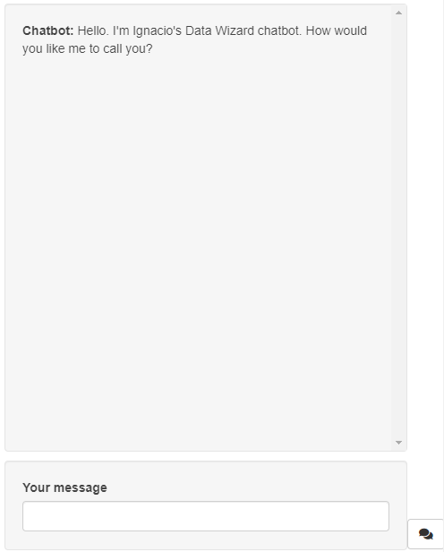
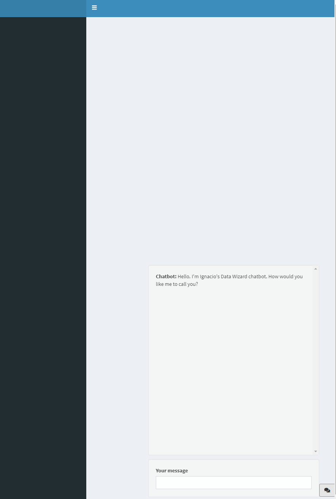

<!-- README.md is generated from README.Rmd. Please edit that file -->
IMWatson
========

The goal of IMWatson is to help you use IBM's Watson Conversation API.

Accessing a chatbot from R
--------------------------

This is a basic example which shows you how to solve a common problem:

``` r
library(IMWatson)
chatbot <- IMWatson::watson_chat_factory$new(api_key = datawizard::data_wizard_secrets()$api_key, 
                                             workspace = datawizard::data_wizard_secrets()$workspace)
chatbot
#> <b>Chatbot:</b> Hello. I'm Ignacio's Data Wizard chatbot. How would you like me to call you?

chatbot$answer('Ignacio')

chatbot
#> <b>Chatbot:</b> Hello. I'm Ignacio's Data Wizard chatbot. How would you like me to call you?
#> <b>You:</b> Ignacio
#> <b>Chatbot:</b> Hi Ignacio. I can help you craft your research question. If you already have a question, I can help you determine you approach. What would you like to do?

chatbot$context
#> {"conversation_id":"784beec1-0ed7-4595-ade8-9711d6f7b678","system":{"initialized":true,"dialog_stack":[{"dialog_node":"root"}],"dialog_turn_counter":2,"dialog_request_counter":2,"_node_output_map":{"Welcome":0,"node_23_1507666135810":0},"branch_exited":true,"branch_exited_reason":"completed"},"username":"Ignacio"}
```

A shiny chatbot
---------------

    IMWatson::ShinyChatbot(api_key = datawizard::data_wizard_secrets()$api_key, 
                           workspace = datawizard::data_wizard_secrets()$workspace)



A shiny chatbot module
----------------------

    ## app.R ##
    library(shiny)
    library(shinydashboard)
    library(IMWatson)
    ui <- dashboardPage(
      dashboardHeader(),
      dashboardSidebar(),
      dashboardBody(IMWatson::chatbotUI("watson"))
    )
    server <- function(input, output, session) {
      callModule(IMWatson::chatbot, "watson", 
                 api_key = datawizard::data_wizard_secrets()$api_key, 
                 workspace = datawizard::data_wizard_secrets()$workspace)
    }
    shinyApp(ui, server)



How do I get it? Drat!
======================

    drat::addRepo(account = "Ignacio", alturl = "https://drat.ignacio.website/")
    install.packages("IMWatson")

If you add `drat::addRepo(account = "Ignacio", alturl = "https://drat.ignacio.website/")` to your `.Rprofile` you will be able to install the updates as with any other R package
